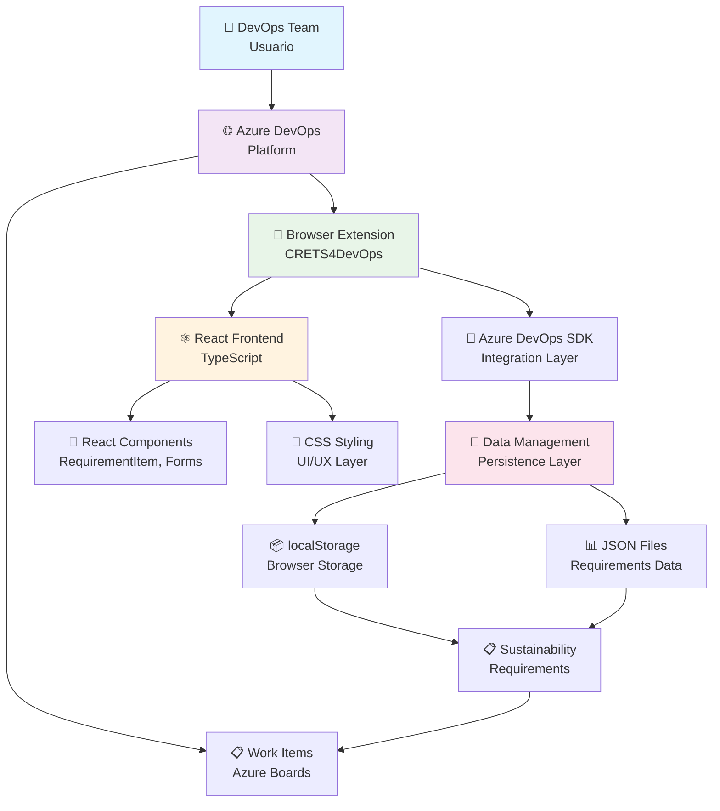
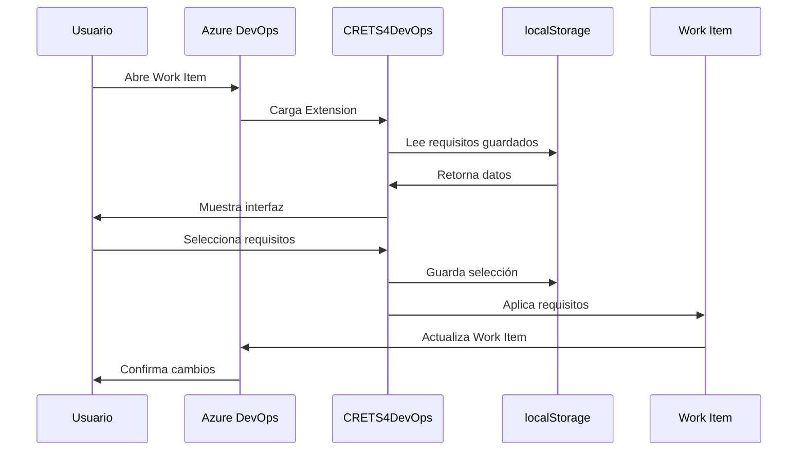

# CRETS4DevOps - Diagrama de Arquitectura

## Arquitectura del Sistema

## Flujo de Datos

## Componentes Tecnológicos

| Componente | Tecnología | Propósito |
|------------|------------|-----------|
| Frontend | React + TypeScript | Interfaz de usuario |
| Extension Platform | Azure DevOps SDK | Integración nativa |
| Persistencia | localStorage + JSON | Almacenamiento de datos |
| Styling | CSS3 | Presentación visual |
| Build System | Webpack + npm | Empaquetado y distribución |

## Instrucciones de Uso

1. **Para visualizar en GitHub**: Este diagrama se renderiza automáticamente en archivos .md
2. **Para herramientas online**: Copiar el código Mermaid a [mermaid.live](https://mermaid.live)
3. **Para VS Code**: Instalar la extensión "Mermaid Preview"
