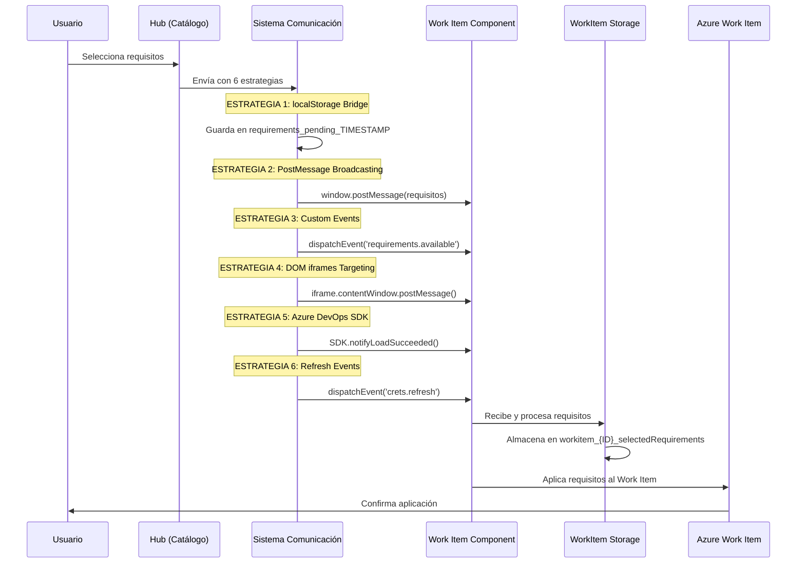
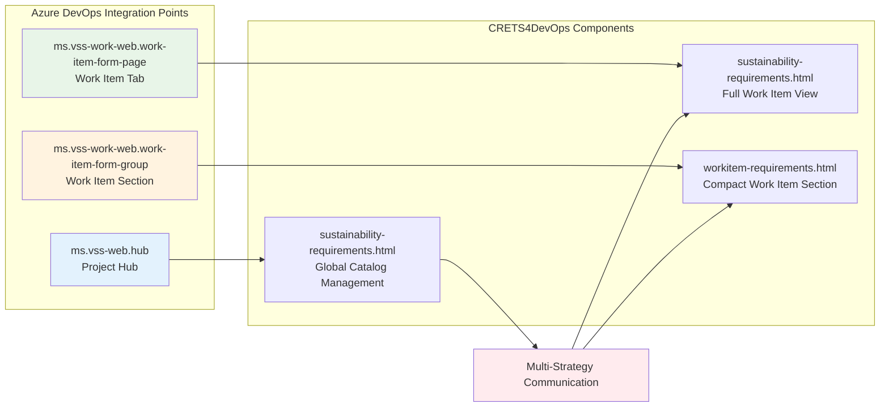

# CRETS4DevOps - Diagrama de Arquitectura V3

## Arquitectura del Sistema Avanzada

```mermaid
graph TB
    User[👤 DevOps Team<br/>Usuario] --> AzureDevOps[🌐 Azure DevOps<br/>Platform]
    
    AzureDevOps --> WorkItems[📋 Work Items<br/>Azure Boards]
    AzureDevOps --> ExtensionHub[📱 CRETS4DevOps Hub<br/>sustainability-requirements]
    AzureDevOps --> ExtensionWorkItem[🔧 CRETS4DevOps WorkItem<br/>workitem-requirements]
    
    ExtensionHub --> FrontendHub[⚛️ React Frontend Hub<br/>Global Catalog Management]
    ExtensionWorkItem --> FrontendWorkItem[⚛️ React Frontend WorkItem<br/>Independent Work Item View]
    
    FrontendHub --> ComponentsHub[🧩 Hub Components<br/>RequirementItem, CreateForm, EditForm]
    FrontendWorkItem --> ComponentsWorkItem[🧩 WorkItem Components<br/>Applied Requirements, EditInPlace]
    
    ComponentsHub --> StylingHub[🎨 CSS Styling Hub<br/>sustainability-requirements.css]
    ComponentsWorkItem --> StylingWorkItem[🎨 CSS Styling WorkItem<br/>workitem-requirements.css]
    
    FrontendHub --> SDK1[🔧 Azure DevOps SDK<br/>Hub Integration]
    FrontendWorkItem --> SDK2[🔧 Azure DevOps SDK<br/>WorkItem Integration]
    
    SDK1 --> DataLayerGlobal[💾 Global Data Management<br/>Catalog Persistence]
    SDK2 --> DataLayerWorkItem[💾 WorkItem Data Management<br/>Independent Persistence]
    
    DataLayerGlobal --> LocalStorageGlobal[📦 localStorage Global<br/>sustainabilityRequirements]
    DataLayerWorkItem --> LocalStorageWorkItem[📦 localStorage WorkItem<br/>workitem_{ID}_*]
    
    DataLayerGlobal --> JSONFiles[📊 JSON Files<br/>Requirements Catalog]
    
    LocalStorageGlobal --> Requirements[📋 Global Catalog<br/>Sustainability Requirements]
    LocalStorageWorkItem --> RequirementsApplied[📋 Applied Requirements<br/>Per Work Item]
    JSONFiles --> Requirements
    
    Requirements --> Communication[📡 Multi-Strategy Communication<br/>6 Communication Methods]
    Communication --> RequirementsApplied
    RequirementsApplied --> WorkItems
    
    style User fill:#e1f5fe
    style AzureDevOps fill:#f3e5f5
    style ExtensionHub fill:#e8f5e8
    style ExtensionWorkItem fill:#fff3e0
    style FrontendHub fill:#fce4ec
    style FrontendWorkItem fill:#f1f8e9
    style DataLayerGlobal fill:#e3f2fd
    style DataLayerWorkItem fill:#fffde7
    style Communication fill:#ffebee
```

## Flujo de Comunicación Multi-Estrategia



## Arquitectura de Storage Independiente

```mermaid
graph TB
    subgraph "Global Storage (Hub)"
        GlobalLS[localStorage Global<br/>sustainabilityRequirements]
        GlobalJSON[JSON Files<br/>Catalog Data]
        GlobalFallback[Hardcoded Fallback<br/>Sample Data]
    end
    
    subgraph "Work Item A Storage"
        WIA_Selected[workitem_12345_selectedRequirements<br/>Applied Requirements]
        WIA_Removed[workitem_12345_removedRequirementIds<br/>Removed Requirements]
        WIA_Modified[workitem_12345_modifiedData<br/>Custom Modifications]
    end
    
    subgraph "Work Item B Storage"
        WIB_Selected[workitem_67890_selectedRequirements<br/>Applied Requirements]
        WIB_Removed[workitem_67890_removedRequirementIds<br/>Removed Requirements]  
        WIB_Modified[workitem_67890_modifiedData<br/>Custom Modifications]
    end
    
    subgraph "Communication Layer"
        Strategy1[📦 localStorage Bridge]
        Strategy2[📤 PostMessage Broadcast]
        Strategy3[🔔 Custom Events]
        Strategy4[🎯 DOM iframes Targeting]
        Strategy5[🔧 Azure DevOps SDK]
        Strategy6[🔄 Refresh Events]
    end
    
    GlobalLS --> Strategy1
    Strategy1 --> WIA_Selected
    Strategy2 --> WIA_Selected
    Strategy3 --> WIA_Selected
    Strategy4 --> WIA_Selected
    Strategy5 --> WIA_Selected
    Strategy6 --> WIA_Selected
    
    GlobalLS --> Strategy1
    Strategy1 --> WIB_Selected
    Strategy2 --> WIB_Selected
    Strategy3 --> WIB_Selected
    Strategy4 --> WIB_Selected
    Strategy5 --> WIB_Selected
    Strategy6 --> WIB_Selected
    
    style GlobalLS fill:#e3f2fd
    style WIA_Selected fill:#e8f5e8
    style WIA_Removed fill:#fff3e0
    style WIA_Modified fill:#fce4ec
    style WIB_Selected fill:#e8f5e8
    style WIB_Removed fill:#fff3e0
    style WIB_Modified fill:#fce4ec
    style Strategy1 fill:#ffebee
    style Strategy2 fill:#f1f8e9
    style Strategy3 fill:#fff8e1
    style Strategy4 fill:#f3e5f5
    style Strategy5 fill:#e0f2f1
    style Strategy6 fill:#fce4ec
```



## Componentes Tecnológicos V3

| Componente | Tecnología | Propósito | Nuevo en V3 |
|------------|------------|-----------|-------------|
| **Hub Frontend** | React + TypeScript | Gestión global de catálogo | ❌ |
| **WorkItem Frontend** | React + TypeScript | Vista específica por Work Item | ✅ |
| **Extension Platform** | Azure DevOps SDK | Integración nativa múltiple | ✅ |
| **Storage Global** | localStorage + JSON | Catálogo compartido | ❌ |
| **Storage WorkItem** | localStorage independiente | Datos aislados por Work Item | ✅ |
| **Communication System** | Multi-strategy (6 métodos) | Comunicación robusta | ✅ |
| **Styling Hub** | CSS3 | Presentación del catálogo | ❌ |
| **Styling WorkItem** | CSS3 independiente | Presentación por Work Item | ✅ |
| **Build System** | Webpack multi-entry | Empaquetado optimizado | ✅ |

## Integración Azure DevOps V3



## Instrucciones de Uso

1. **Para visualizar en GitHub**: Estos diagramas se renderizan automáticamente en archivos .md
2. **Para herramientas online**: Copiar el código Mermaid a [mermaid.live](https://mermaid.live)
3. **Para VS Code**: Instalar la extensión "Mermaid Preview"
4. **Para documentación interactiva**: Abrir `architecture-interactive.html` en navegador

## Diferencias Clave V3 vs V2

### ✅ **Nuevas Funcionalidades V3**
- **Dual Component Architecture**: Hub + WorkItem components independientes
- **WorkItemStorage Class**: Sistema de storage completamente aislado por Work Item
- **Multi-Strategy Communication**: 6 métodos de comunicación simultáneos
- **In-Place Editing**: Edición independiente de requisitos por Work Item
- **Auto-Cleanup**: Limpieza automática de storage obsoleto
- **Multiple Integration Points**: 3 puntos de integración en Azure DevOps

### 📈 **Mejoras de Performance V3**
- **Webpack Multi-Entry**: Build optimizado con múltiples puntos de entrada
- **Independent Loading**: Carga específica por contexto (Hub vs WorkItem)
- **Storage Optimization**: Acceso directo a datos relevantes por Work Item
- **Communication Efficiency**: Estrategias de fallback para máxima compatibilidad
