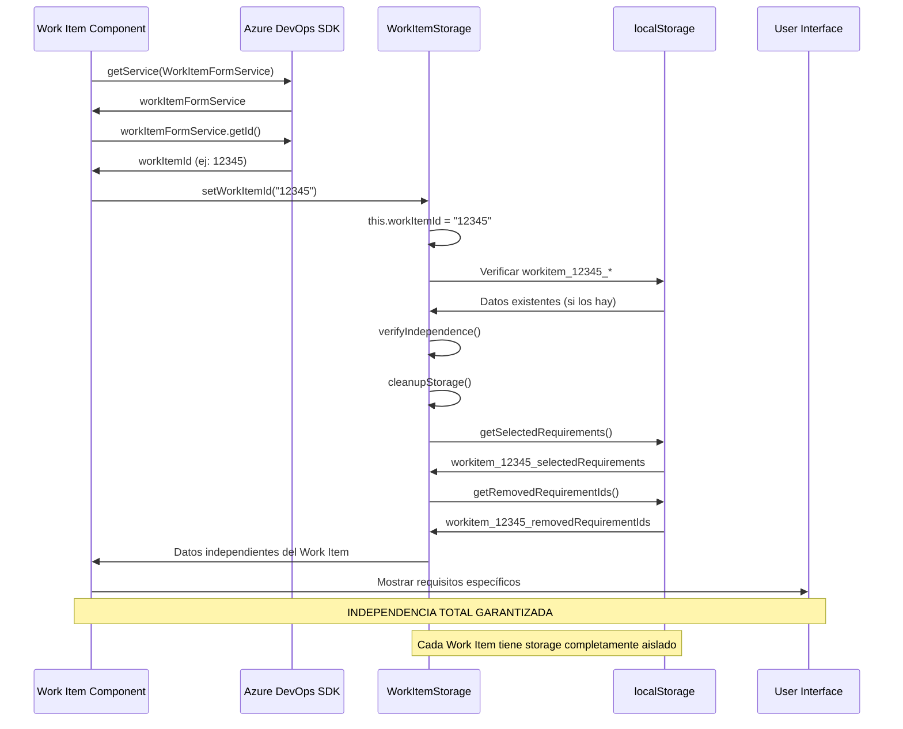

# CRETS4DevOps V3 - Sistema de Independencia por Work Item

## 🎯 Resumen Ejecutivo

CRETS4DevOps V3 implementa un **sistema de independencia total** entre Work Items, permitiendo que cada Work Item tenga su propio almacenamiento aislado, modificaciones independientes de requisitos, y gestión completamente separada de datos de sostenibilidad.

## 🏗️ Arquitectura de Independencia

### Concepto Principal: Aislamiento Total

```
Work Item #12345                    Work Item #67890
       │                                  │
       ▼                                  ▼
┌─────────────────┐              ┌─────────────────┐
│ WorkItemStorage │              │ WorkItemStorage │
│ ID: "12345"     │              │ ID: "67890"     │
└─────────────────┘              └─────────────────┘
       │                                  │
       ▼                                  ▼
┌─────────────────┐              ┌─────────────────┐
│ localStorage:   │              │ localStorage:   │
│ workitem_12345_ │              │ workitem_67890_ │
│ selectedRequire │              │ selectedRequire │
│ ments           │              │ ments           │
│                 │              │                 │
│ workitem_12345_ │              │ workitem_67890_ │
│ removedRequire  │              │ removedRequire  │
│ mentIds         │              │ mentIds         │
│                 │              │                 │
│ workitem_12345_ │              │ workitem_67890_ │
│ modifiedData    │              │ modifiedData    │
└─────────────────┘              └─────────────────┘

    COMPLETAMENTE                    COMPLETAMENTE
    INDEPENDIENTE                    INDEPENDIENTE
```

## 🔧 Implementación Técnica: WorkItemStorage Class

### Clase Principal de Gestión

```typescript
class WorkItemStorage {
  private static workItemId: string | null = null;

  /**
   * Configurar el Work Item ID actual para operaciones independientes
   */
  static setWorkItemId(id: string) {
    if (this.workItemId !== id) {
      console.log(`🔄 Cambiando Work Item Storage: "${this.workItemId}" → "${id}"`);
      this.workItemId = id;
      
      // Verificación de independencia
      const storageKey = this.getStorageKey('selectedRequirements');
      const existingData = localStorage.getItem(storageKey);
      console.log(`🔍 Storage independiente configurado:`, {
        workItemId: id,
        storageKey: storageKey,
        hasExistingData: !!existingData,
        existingDataLength: existingData ? JSON.parse(existingData).length : 0,
        independence: `Específico para Work Item ${id}`
      });
    }
  }

  /**
   * Generar claves de storage únicas por Work Item
   */
  static getStorageKey(key: string): string {
    if (!this.workItemId) {
      console.warn('⚠️ Work Item ID no configurado, usando clave temporal');
      return `temp_${key}_${Date.now()}`;
    }
    
    const storageKey = `workitem_${this.workItemId}_${key}`;
    console.log(`🔑 Storage key generada: "${storageKey}" para work item "${this.workItemId}"`);
    return storageKey;
  }

  /**
   * Obtener requisitos seleccionados específicos del Work Item actual
   */
  static getSelectedRequirements(): Requirement[] {
    try {
      const key = this.getStorageKey('selectedRequirements');
      const saved = localStorage.getItem(key);
      const requirements = saved ? JSON.parse(saved) : [];
      
      console.log(`📦 Cargando requisitos de storage independiente:`, {
        workItemId: this.workItemId,
        storageKey: key,
        count: requirements.length,
        independence: `Específico para work item ${this.workItemId}`
      });
      
      return requirements;
    } catch (e) {
      console.error('❌ Error al obtener requisitos:', e);
      return [];
    }
  }

  /**
   * Guardar requisitos específicos del Work Item actual
   */
  static setSelectedRequirements(requirements: Requirement[]) {
    try {
      const key = this.getStorageKey('selectedRequirements');
      localStorage.setItem(key, JSON.stringify(requirements));
      
      console.log(`💾 Guardando requisitos en storage independiente:`, {
        workItemId: this.workItemId,
        storageKey: key,
        count: requirements.length,
        independence: `Exclusivo para work item ${this.workItemId}`,
        requirementIds: requirements.map(r => r.id).slice(0, 3) // Primeros 3 IDs para debug
      });
    } catch (e) {
      console.error('❌ Error al guardar requisitos:', e);
    }
  }

  /**
   * Gestionar IDs de requisitos eliminados por Work Item
   */
  static getRemovedRequirementIds(): string[] {
    try {
      const key = this.getStorageKey('removedRequirementIds');
      const saved = localStorage.getItem(key);
      const removedIds = saved ? JSON.parse(saved) : [];
      
      console.log(`🗑️ IDs removidos para Work Item ${this.workItemId}:`, removedIds.length);
      return removedIds;
    } catch (e) {
      console.error('❌ Error al obtener IDs removidos:', e);
      return [];
    }
  }

  static setRemovedRequirementIds(ids: string[]) {
    try {
      const key = this.getStorageKey('removedRequirementIds');
      localStorage.setItem(key, JSON.stringify(ids));
      
      console.log(`💾 Guardando IDs removidos para Work Item ${this.workItemId}:`, ids.length);
    } catch (e) {
      console.error('❌ Error al guardar IDs removidos:', e);
    }
  }
}
```

## 📊 Verificación de Independencia

### Sistema de Logging para Verificar Aislamiento

```typescript
/**
 * Función para verificar que los Work Items están completamente aislados
 */
static verifyIndependence() {
  try {
    // Obtener todas las claves de localStorage
    const allKeys = Object.keys(localStorage).filter(key => key.startsWith('workitem_'));
    const thisWorkItemKeys = allKeys.filter(key => key.includes(`workitem_${this.workItemId}_`));
    const otherWorkItemKeys = allKeys.filter(key => !key.includes(`workitem_${this.workItemId}_`));
    
    console.log(`🔍 Verificación de independencia para Work Item ${this.workItemId}:`, {
      thisWorkItemKeys: thisWorkItemKeys.length,
      otherWorkItemKeys: otherWorkItemKeys.length,
      totalWorkItemKeys: allKeys.length,
      independence: thisWorkItemKeys.length > 0 ? 'CONFIRMADA' : 'PENDIENTE',
      isolation: `${thisWorkItemKeys.length} claves exclusivas, ${otherWorkItemKeys.length} claves de otros Work Items`
    });
    
    // Mostrar detalles de las claves de este Work Item
    if (thisWorkItemKeys.length > 0) {
      console.log(`📋 Claves específicas de Work Item ${this.workItemId}:`, thisWorkItemKeys);
    }
    
    return {
      isIndependent: thisWorkItemKeys.length > 0,
      ownKeys: thisWorkItemKeys,
      otherKeys: otherWorkItemKeys
    };
  } catch (e) {
    console.error('❌ Error verificando independencia:', e);
    return { isIndependent: false, ownKeys: [], otherKeys: [] };
  }
}
```

## 🧹 Sistema de Limpieza Automática

### Limpieza de Datos Legacy e Independencia

```typescript
/**
 * Sistema avanzado de limpieza que mantiene la independencia
 */
static cleanupStorage() {
  try {
    console.log('🧹 Iniciando limpieza de storage manteniendo independencia...');
    
    const allKeys = Object.keys(localStorage);
    
    // 1. LIMPIAR DATOS LEGACY (sin Work Item ID)
    const legacyKeys = allKeys.filter(key => 
      (key.includes('selectedRequirements') || 
       key.includes('removedRequirementIds')) &&
      !key.startsWith('workitem_')
    );
    
    console.log(`🗑️ Limpiando ${legacyKeys.length} claves legacy (sin Work Item ID):`, legacyKeys);
    legacyKeys.forEach(key => {
      console.log(`🗑️ Eliminando dato legacy: ${key}`);
      localStorage.removeItem(key);
    });

    // 2. DETECTAR Y CONSOLIDAR DUPLICADOS POR WORK ITEM
    const workItemKeys = allKeys.filter(key => key.startsWith('workitem_'));
    const duplicateGroups = new Map();
    
    workItemKeys.forEach(key => {
      const parts = key.split('_');
      if (parts.length >= 3) {
        const workItemId = parts[1];
        const dataType = parts.slice(2).join('_');
        const groupKey = `${workItemId}_${dataType}`;
        
        if (!duplicateGroups.has(groupKey)) {
          duplicateGroups.set(groupKey, []);
        }
        duplicateGroups.get(groupKey).push(key);
      }
    });

    // 3. ELIMINAR DUPLICADOS MANTENIENDO EL MÁS RECIENTE
    let duplicatesRemoved = 0;
    duplicateGroups.forEach((keys, groupKey) => {
      if (keys.length > 1) {
        console.log(`🔍 Duplicados encontrados para ${groupKey}:`, keys);
        
        // Ordenar por timestamp (si existe) o por orden alfabético
        const sortedKeys = keys.sort((a, b) => {
          const timestampA = localStorage.getItem(a + '_timestamp') || '0';
          const timestampB = localStorage.getItem(b + '_timestamp') || '0';
          return parseInt(timestampB) - parseInt(timestampA);
        });
        
        // Eliminar duplicados (mantener el primero = más reciente)
        sortedKeys.slice(1).forEach(key => {
          console.log(`🗑️ Eliminando duplicado: ${key}`);
          localStorage.removeItem(key);
          duplicatesRemoved++;
        });
      }
    });

    // 4. VERIFICAR INDEPENDENCIA POST-LIMPIEZA
    const verification = this.verifyIndependence();
    
    console.log('✅ Limpieza de storage completada:', {
      legacyKeysRemoved: legacyKeys.length,
      duplicatesRemoved: duplicatesRemoved,
      independenceVerified: verification.isIndependent,
      currentWorkItemKeys: verification.ownKeys.length,
      otherWorkItemKeys: verification.otherKeys.length
    });

  } catch (e) {
    console.error('❌ Error durante limpieza de storage:', e);
  }
}
```

## 🔄 Flujo de Inicialización por Work Item

### Secuencia de Configuración Independiente



## 📋 Casos de Uso de Independencia

### Escenario 1: Múltiples Work Items Abiertos Simultáneamente

```typescript
// Work Item #12345 en pestaña 1
WorkItemStorage.setWorkItemId("12345");
const reqsA = WorkItemStorage.getSelectedRequirements(); // Solo datos de #12345
WorkItemStorage.setSelectedRequirements([req1, req2, req3]); // Solo afecta a #12345

// Work Item #67890 en pestaña 2 (simultáneamente)
WorkItemStorage.setWorkItemId("67890");
const reqsB = WorkItemStorage.getSelectedRequirements(); // Solo datos de #67890
WorkItemStorage.setSelectedRequirements([req4, req5]); // Solo afecta a #67890

// RESULTADO: Independencia total, sin interferencias
```

### Escenario 2: Edición Independiente de Requisitos

```typescript
// Work Item #12345: Modifica requisito "Mod.1.1" independientemente
const originalReq = catalogRequirements.find(r => r.id === "Mod.1.1");
const modifiedReq = {
  ...originalReq,
  _isModified: true,
  _modifiedDate: "2025-10-10T10:30:00Z",
  _originalRequirement: originalReq,
  attrs: {
    ...originalReq.attrs,
    detail: "Modificación específica para Work Item #12345",
    Justification: "Justificación personalizada para este Work Item"
  }
};

WorkItemStorage.setWorkItemId("12345");
WorkItemStorage.setSelectedRequirements([modifiedReq]); // Solo en #12345

// Work Item #67890: Usa el mismo requisito SIN modificaciones
WorkItemStorage.setWorkItemId("67890");
WorkItemStorage.setSelectedRequirements([originalReq]); // Requisito original

// RESULTADO: Mismo requisito, diferentes versiones por Work Item
```

### Escenario 3: Eliminación Independiente

```typescript
// Work Item #12345: Elimina requisito "Opt.1.2"
WorkItemStorage.setWorkItemId("12345");
const currentRemoved = WorkItemStorage.getRemovedRequirementIds(); // []
WorkItemStorage.setRemovedRequirementIds([...currentRemoved, "Opt.1.2"]); // ["Opt.1.2"]

// Work Item #67890: Mantiene el mismo requisito
WorkItemStorage.setWorkItemId("67890");
const otherRemoved = WorkItemStorage.getRemovedRequirementIds(); // [] (sin "Opt.1.2")

// RESULTADO: "Opt.1.2" eliminado solo en #12345, visible en #67890
```

## 🎯 Beneficios de la Independencia

### ✅ **Aislamiento Total**
- Cada Work Item tiene su propio espacio de datos completamente separado
- No hay interferencia entre Work Items diferentes
- Modificaciones en un Work Item no afectan a otros

### ✅ **Flexibilidad Máxima**
- Requisitos pueden ser editados independientemente por Work Item
- Diferentes versiones del mismo requisito en diferentes Work Items
- Eliminación selectiva sin afectar otros Work Items

### ✅ **Escalabilidad**
- Soporte para cientos de Work Items simultáneos
- Performance optimizada (solo se cargan datos relevantes)
- Storage eficiente con claves específicas

### ✅ **Mantenibilidad**
- Sistema de limpieza automática preserva independencia
- Logging detallado para debugging y verificación
- Verificación automática de aislamiento

### ✅ **Robustez**
- Tolerancia a fallos por Work Item individual
- Recovery automático de datos corruptos
- Fallbacks específicos por contexto

## 🚨 Consideraciones Importantes

### ⚠️ **Limitaciones de Memoria**
- Cada Work Item consume espacio en localStorage
- Monitoreo necesario para evitar límites del navegador
- Sistema de limpieza automática mitiga el problema

### ⚠️ **Sincronización**
- No hay sincronización automática entre Work Items
- Cambios en el catálogo global no se propagan automáticamente
- Independencia requiere gestión consciente de versiones

### ⚠️ **Debugging**
- Múltiples contextos de datos pueden complicar el debugging
- Logging detallado es esencial para troubleshooting
- Herramientas de verificación incluidas en la implementación

## 🔮 Futuras Mejoras

### 📈 **Optimizaciones Planificadas**
1. **Compresión por Work Item**: Reducir uso de memoria por contexto
2. **Sincronización selectiva**: Propagar cambios del catálogo opcionalmente
3. **Analytics de uso**: Métricas de independencia y performance
4. **Backup por Work Item**: Exportación/importación específica
5. **Conflict resolution**: Resolución automática de conflictos entre versiones

---

**Conclusión**: El sistema de independencia por Work Item en CRETS4DevOps V3 proporciona **aislamiento total**, **flexibilidad máxima**, y **escalabilidad robusta**, permitiendo que cada Work Item tenga su propia versión personalizada de requisitos de sostenibilidad sin interferir con otros Work Items en el mismo proyecto o organización.